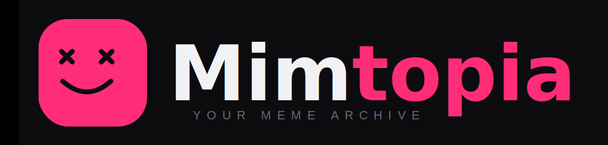

<p align="center">
  
</p>

<h1 align="center">Mimtopia</h1>

<p align="center">
  <b>밈(Meme)을 발견하고, 만들고, 나누는 공간</b><br/>
  <sub>Discover · Create · Share the Internet's Best Memes</sub>
</p>

<p align="center">
  <a href="https://mimtopia.com"></a>
  <br/><br/>
  
  
  
  
  
  
  
</p>

---

## 프로젝트 소개

**Mimtopia**는 밈(Meme) 문화를 중심으로 한 인터랙티브 소셜 플랫폼입니다.
사용자들이 최신 밈을 탐색하고 직접 게시하며, 좋아요와 조회수 기반의 랭킹 시스템으로 커뮤니티와 실시간으로 소통할 수 있습니다.

---

## 주요 기능

| 기능 | 설명 |
|---|---|
| 밈 피드 | 최신순 / 인기순으로 밈을 탐색 |
| 밈 게시 | 제목과 내용으로 나만의 밈 업로드 |
| 좋아요 | 마음에 드는 밈에 좋아요 누르기 & 모아보기 |
| 조회수 추적 | 각 밈의 실시간 조회 통계 |
| 인증 | 안전한 세션 기반 로그인 / 회원가입 |
| 권한 관리 | 본인이 작성한 밈만 수정 · 삭제 가능 |

---

## 기술 스택

### Frontend
- **React 19** + **TypeScript 5.9** — 타입 안전한 모던 UI
- **Vite 8** — 초고속 빌드 및 HMR 개발 환경
- **React Router DOM 7** — 클라이언트 사이드 라우팅
- **Axios** — 쿠키 자격증명 포함 HTTP 통신
- **CSS Modules** — 컴포넌트 스코프 스타일링

### Backend
- **Spring Boot 4.0** (Java 17) — 강력하고 확장 가능한 REST API
- **JPA / Hibernate** — 객체-관계 매핑(ORM)
- **Session 기반 인증** — UUID 세션 토큰 + HttpOnly 쿠키
- **Swagger / OpenAPI** — 자동 생성 API 문서
- **Redis** — 캐싱 레이어

### Infrastructure
- **MySQL** — 운영 데이터베이스
- **H2** — 테스트 인메모리 데이터베이스
- **Docker** — eclipse-temurin:17-jre 기반 컨테이너화

---

## 아키텍처

```
[Browser]
    │  React 19 + TypeScript
    │  Axios (with credentials)
    ▼
[Spring Boot API]
    │  SessionAuthenticationFilter
    │  Controller → Service → Repository
    ▼
[MySQL]  ←→  [Redis Cache]
```

**인증 플로우**
1. 로그인 요청 → 서버가 UUID 세션 발급
2. HttpOnly + Secure 쿠키로 세션 전달
3. 이후 모든 요청에서 쿠키를 통해 자동 인증

---

## 저장소

| 저장소 | 설명 |
|---|---|
| [mimtopia-api](https://github.com/mimtopia/mimtopia-api) | Spring Boot 백엔드 API 서버 |
| [mimtopia-fe](https://github.com/mimtopia/mimtopia-fe) | React + TypeScript 프론트엔드 |

---

## API 엔드포인트

| Method | Path | 설명 | 인증 |
|---|---|---|---|
| `POST` | `/login` | 로그인 | ✗ |
| `POST` | `/sign-up` | 회원가입 | ✗ |
| `GET` | `/memes` | 밈 목록 (최신순) | ✗ |
| `GET` | `/memes/by-popularity` | 밈 목록 (인기순) | ✗ |
| `GET` | `/memes/liked` | 내가 좋아요한 밈 | ✓ |
| `GET` | `/memes/{id}` | 밈 상세 | ✗ |
| `POST` | `/memes` | 밈 생성 | ✓ |
| `PUT` | `/memes/{id}` | 밈 수정 | ✓ (작성자) |
| `DELETE` | `/memes/{id}` | 밈 삭제 | ✓ (작성자) |

---

<p align="center">
  <sub><i>Mimtopia — 밈 애호가들을 위한 최고의 목적지.</i></sub>
</p>
